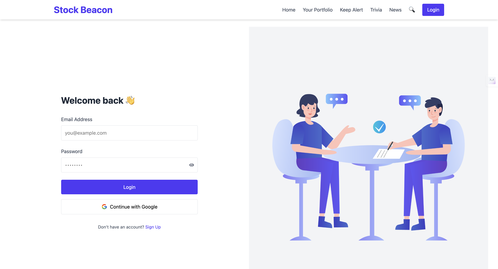
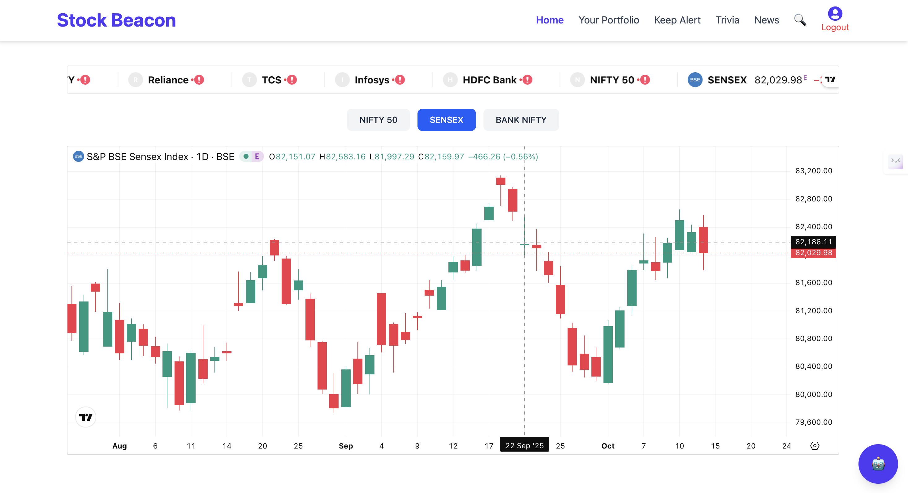
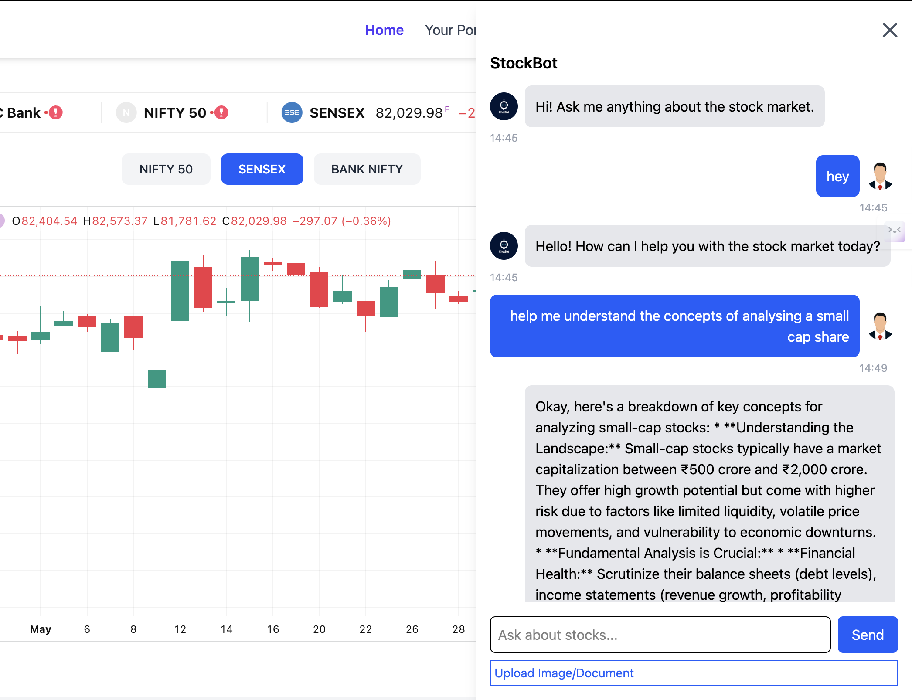
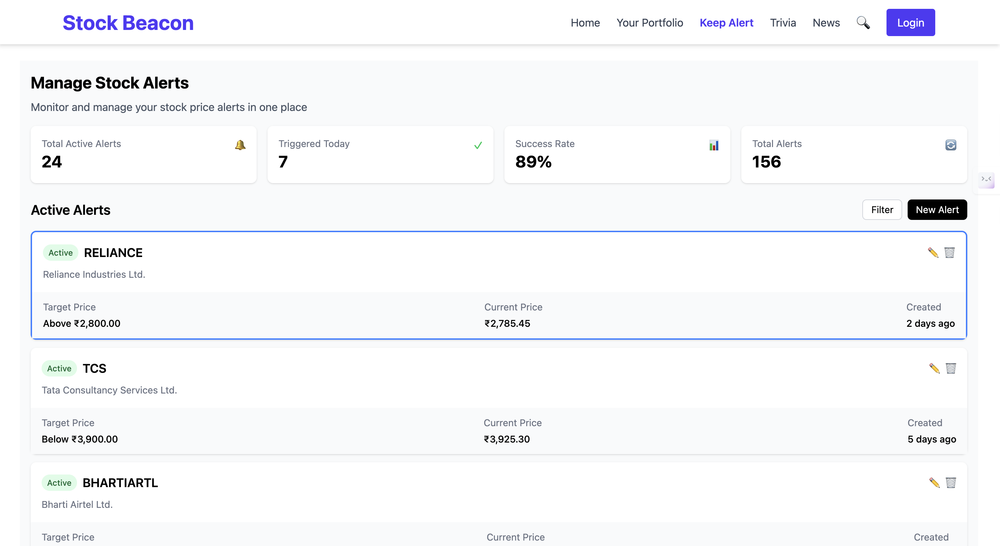
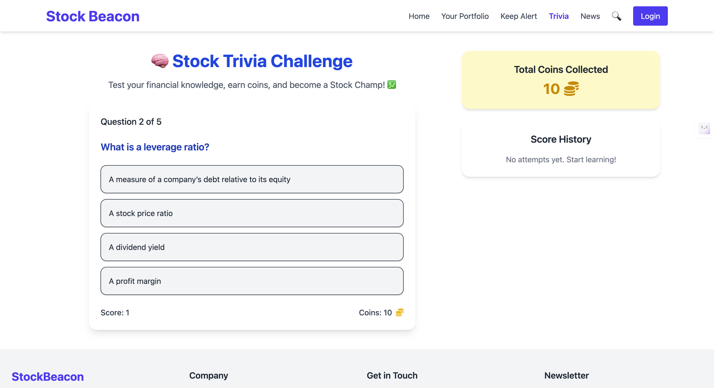
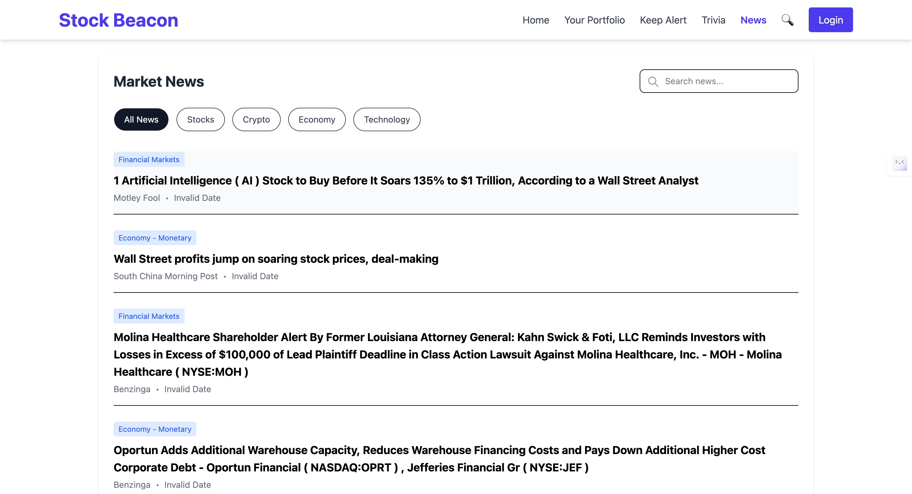

<h1 align="center">Stock Beacon</h1>

<p align="center">
  <b>Your AI-powered Stock Learning and Tracking Platform.</b><br/>
  Smarter investing starts here — track markets, learn with AI, and trade with confidence.
</p>

<p align="center">
  
  
  
  
  
</p>

---


## 🌟 Overview

**Stock Beacon** bridges the gap between *stock education* and *real-time tracking*.  
It empowers users to:
- 📈 Track live indices like NIFTY, SENSEX, and BANK NIFTY.
- 🤖 Interact with an AI chatbot for stock-related queries.
- 💼 Manage and analyze their personal portfolios.
- 🔔 Set alerts for price limits and get AI-powered notifications.
- 🧠 Learn through quizzes tailored for beginners.
- 📰 Read verified market news from trusted APIs.
- 💳 Access premium content securely using Razorpay.
- 🔐 Enjoy seamless sign-in via Google Authentication.

> A complete stock ecosystem for both learners and investors.

---

## ⚙️ Key Features

- **AI Chatbot:** Ask any stock market question — from basic concepts to live updates.  
- **Live Market Data:** TradingView integration provides real-time charts for Sensex, Nifty, and more.  
- **Portfolio Management:** Track holdings and performance with AI-driven analytics.  
- **Smart Alerts:** Set buy/sell thresholds and receive notifications instantly.  
- **Trivia Section:** Fun, gamified quizzes to make learning enjoyable.  
- **News Feed:** Stay ahead with authentic, automatically updated financial news.  
- **Razorpay Premium Access:** Unlock advanced features and news insights.  
- **Google Auth:** Fast and secure login powered by OAuth 2.0.

---

## 🧩 Tech Stack

| Layer | Technologies Used |
|-------|--------------------|
| **Frontend** | React.js, Tailwind CSS, TradingView Widget, Context API |
| **Backend** | Node.js, Express.js |
| **Database** | MongoDB (Mongoose) |
| **Integrations** | Google OAuth 2.0, Razorpay API, News API |
| **AI Engine** | Custom AI assistant integrated via backend APIs |
| **Hosting** | Render (Backend) + Netlify/Vercel (Frontend) |

---

## 🗂️ Folder Structure

```
StockBeacon/
├── backend/
│   ├── config/
│   ├── middlewares/
│   ├── models/
│   ├── routes/
│   ├── passport.js
│   ├── ai.js
│   ├── auth.js
│   ├── server.js
│
├── frontend/
│   ├── src/
│   │   ├── components/
│   │   │   ├── AIChatbot.jsx
│   │   │   ├── Footer.jsx
│   │   │   ├── Navbar.jsx
│   │   │   ├── Trivia.jsx
│   │   │   ├── SignUp.jsx
│   │   │   ├── Home.jsx
│   │   │   ├── Portfolio.jsx
│   │   │   ├── KeepAlert.jsx
│   │   │   └── News.jsx
│   ├── App.jsx
│   ├── main.jsx
│   ├── index.css
│   └── vite.config.js
└── README.md
```

---

## 🖼️ Screenshots (Preview)

### 🏠 Home Page  
Real-time market dashboard with candlestick charts and stock widgets. 
 


---

### 🤖 AI Chatbot  
Conversational AI that answers any stock market question.  


---

### 💼 🔔 Portfolio and Alert Page  
Analyze and visualize personal holdings with insights of getting limits alerts for your targeted stocks.  



---

### 🧠 Trivia Page  
Interactive quiz for beginners to learn while earning coins.  


---

### 📰 News Page  
Aggregated financial news from authentic APIs.  


---


## 🧠 AI Chatbot

The AI Chatbot acts as a **personal stock assistant**, capable of:
- Explaining stock terms and trends.  
- Providing updates about indices and company stocks.  
- Answering educational queries about finance and investing.

---

## 🚀 Getting Started

### 1. Clone the Repository
```bash
git clone https://github.com/Devansh1974/StockBeacon.git
cd stockbeacon
```

### 2. Install Dependencies
```bash
npm install
cd frontend && npm install
```

### 3. Environment Variables
Create a `.env` file in the backend root with your own following keys:

```env
MONGO_URI=
GOOGLE_CLIENT_ID=
GOOGLE_CLIENT_SECRET=
RAZORPAY_KEY_ID=
RAZORPAY_SECRET=
NEWS_API_KEY=
PORT=5000
```

### 4. Run Application
```bash
# Run backend
npm start

# Run frontend
cd frontend
npm run dev
```

---

## 🌐 Deployment Links

- **Frontend:** [Live URL](stockbeaconn.netlify.app)  
- **Backend:** [Render Deployment](https://s69-devansh-capstone-stockbeacon.onrender.com/)

---

## 🔮 Future Enhancements

- Stock price prediction using Machine Learning.  
- Social sharing of portfolio analytics.  
- Personalized learning paths for beginners.  
- Mobile app version of Stock Beacon.  

---

## 👤 Author

**Developed by:** [Devansh Singh](https://www.linkedin.com/in/devanshsingh2006/)  
📧 **Email:** [devanshsingh1974@gmail.com](mailto:devanshsingh1974@gmail.com)

---

## ⚖️ License

This project is licensed under the **MIT License** – feel free to use and modify with credit.

---

**© 2025 Stock Beacon | Built with ❤️ by Devansh Singh**
